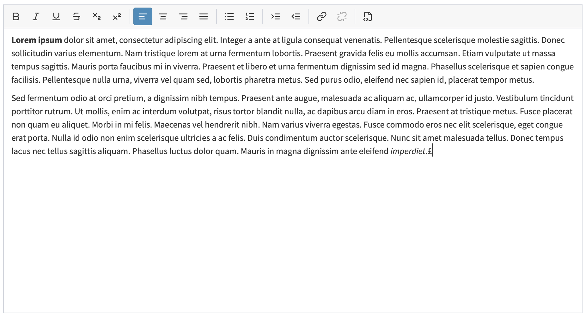

# FlexibleUxLexicalBundle

A reusable Symfony bundle providing **`LexicalFormType`** — a lightweight rich-text editor
form field built on Meta's [Lexical](https://lexical.dev), wired for
[AssetMapper](https://symfony.com/doc/current/frontend/asset_mapper.html),
[Stimulus](https://symfony.com/bundles/StimulusBundle) and
[UX Icons](https://symfony.com/bundles/ux-icons).

The field renders a toolbar (undo / redo, cut / copy / paste — including paste from Word —,
bold, italic, underline, strikethrough, subscript / superscript, remove format, text alignment,
bulleted / numbered lists, indentation, link, unlink, iframe embeds, HTML source editing) and a
contenteditable surface around a hidden `<textarea>`. The editor reads the
textarea's HTML on load and writes HTML back on every change, so it is a drop-in replacement for a
plain textarea and **degrades to that textarea when JavaScript is disabled**. No build step is
required — everything runs through AssetMapper's importmap.



## Requirements

- PHP 8.2+
- Symfony 7.4 or 8.x with AssetMapper, StimulusBundle and UX Icons

## Installation

Make sure [Composer is installed](https://getcomposer.org/doc/00-intro.md) globally.

#### Step 1: Download the bundle

```console
composer require flexible-ux/lexical-bundle
```

With **Symfony Flex**, `composer require` already wires the front-end for you: the Lexical packages are
added to your `importmap.php` (from the bundle's `assets/package.json`) and the Stimulus controller is
enabled in your `assets/controllers.json`. Skip to step 3.

#### Step 2 (without Flex): wire the front-end manually

Add the Lexical packages to your importmap:

```console
php bin/console importmap:require lexical @lexical/extension @lexical/rich-text @lexical/html @lexical/clipboard @lexical/list @lexical/link @lexical/history @lexical/utils
```

and enable the Stimulus controller in `assets/controllers.json`:

```json
{
    "controllers": {
        "@flexible-ux/lexical-bundle": {
            "lexical": { "enabled": true, "fetch": "lazy" }
        }
    }
}
```

#### Step 3: Enable the bundle

The bundle does not ship a Flex recipe yet, so register it in `config/bundles.php` (Flex and non-Flex
alike):

```php
// config/bundles.php
return [
    // ...
    FlexibleUx\LexicalBundle\FlexibleUxLexicalBundle::class => ['all' => true],
];
```

That's it. The bundle registers its AssetMapper path, the form theme and the toolbar icons
automatically; the editor's CSS is imported by the controller, so there is nothing else to include.

## Usage

```php
use FlexibleUx\LexicalBundle\Form\Type\LexicalFormType;

$builder->add('description', LexicalFormType::class);
```

With options:

```php
$builder->add('description', LexicalFormType::class, [
    'label'   => 'Description',
    'required' => false,
    'toolbar' => ['bold', 'italic', 'bullet', 'number', 'link', 'unlink'],
    'height'  => '320px',
]);
```

### Options

| Option                 | Type       | Default                                    | Description                                             |
|------------------------|------------|--------------------------------------------|---------------------------------------------------------|
| `toolbar`              | `string[]` | all 25 buttons in eight `\|`-separated groups | Ordered toolbar entries: button names and `\|` separators. |
| `height`               | `string`   | `'200px'`                                  | Minimum editable height (any CSS length).               |
| `allowed_link_schemes` | `string[]` | `['http','https','mailto','tel']`          | URL schemes the link modal accepts.                     |

#### Toolbar and grouping

Available buttons:

`undo` · `redo` · `cut` · `copy` · `paste` · `paste-word` · `bold` · `italic` · `underline` ·
`strikethrough` · `subscript` · `superscript` · `remove-format` · `align-left` · `align-center` ·
`align-right` · `align-justify` · `bullet` · `number` · `indent` · `outdent` · `link` · `unlink` ·
`iframe` · `source`

The `paste` and `paste-word` buttons read the system clipboard through the asynchronous Clipboard
API, so they need a secure context and (browser-dependent) the user's permission; when access is
denied the editor shows a translated hint to paste with <kbd>Ctrl</kbd>+<kbd>V</kbd> instead.
`paste-word` additionally cleans Word's markup and rebuilds its lists — see
[`docs/index.md`](docs/index.md) for details.

The `iframe` button embeds external content (a video, a map, a form) the way CKEditor's *IFrame*
dialog did: a modal asks for the URL, an optional width and height, an advisory title and whether
fullscreen is allowed, and the embed is stored as a plain `<iframe>`. Inside the editor it renders
as a live but inert preview — click it to select it (<kbd>Backspace</kbd> removes it, the toolbar
button reopens the dialog to edit it). The frame source must resolve to an `http(s)` URL; see
[`docs/index.md`](docs/index.md) for what an imported `<iframe>` keeps.

The toolbar renders **exactly the order you give**, and `|` draws a separator — so grouping is
entirely yours to decide:

```php
'toolbar' => ['bold', 'italic', '|', 'link', 'unlink'],   // two groups
'toolbar' => ['bold', 'italic', 'link'],                  // no separators at all
```

Every button is optional and independent: only what you list is rendered. A field that does not
want the alignment features simply leaves the `align-*` entries out (and existing `text-align`
styles in stored content are still preserved when edited — only the toolbar control disappears):

```php
'toolbar' => ['bold', 'italic', '|', 'bullet', 'number', '|', 'link', 'unlink'],   // no alignment
'toolbar' => ['bold', '|', 'align-center'],   // or cherry-pick a single alignment button
```

Leading, trailing and repeated separators are dropped, so a list can never render a stray or doubled
divider. An unknown button name raises a clear `InvalidOptionsException` listing the valid ones.

The field extends `TextareaType`, so all textarea/text field options (`label`, `required`, `attr`,
`constraints`, …) apply too.

#### Link schemes

Restrict (or widen) which link schemes the editor may produce — entries may be written with or without
the trailing colon, and anything outside the list is rejected in the link modal:

```php
$builder->add('description', LexicalFormType::class, [
    'allowed_link_schemes' => ['https'], // https-only links
]);
```

### Application-wide defaults

Rather than repeating options at every call site, set defaults once. Every key mirrors a form option,
and per-field options still win:

```yaml
# config/packages/flexible_ux_lexical.yaml
flexible_ux_lexical:
    toolbar: ['bold', 'italic', '|', 'bullet', 'number', '|', 'link', 'unlink']
    height: '320px'
    allowed_link_schemes: ['https']
```

This is also how a feature is opted out for the whole application at once — the `toolbar` above,
for instance, has no alignment buttons, so no field gets them unless it overrides the option.

Run `php bin/console config:dump-reference flexible_ux_lexical` to see the full reference.

The editor stores **HTML**. When you render that HTML on a public page, output it as trusted markup
(e.g. Twig's `|raw`) — links are restricted to `allowed_link_schemes` and embeds to `http(s)` frame
sources by the editor, but you remain responsible for sanitising any HTML that reaches the field
from other sources.

## How it works

The bundle is deliberately split into four layers so each can be understood and overridden on its own:

- **PHP** — `FlexibleUx\LexicalBundle\Form\Type\LexicalFormType` exposes the `toolbar` / `height` options as view
  variables.
- **HTML** — the `lexical_widget` Twig form theme renders the toolbar, the editable surface and the
  link modal.
- **JS** — the `lexical` Stimulus controller mounts Lexical on the editable element and keeps the
  textarea in sync.
- **CSS** — `assets/styles/lexical.css` (imported by the controller).

See [`docs/index.md`](docs/index.md) for customisation, theming and translation details.

## License

Released under the [MIT License](LICENSE). Bundled icons are from
[Lucide](https://lucide.dev) (ISC License).
